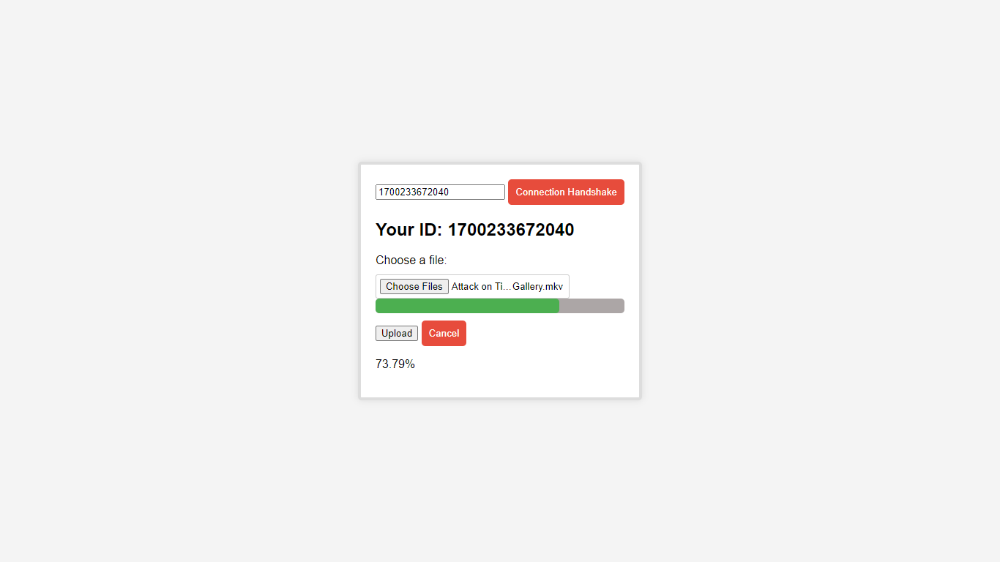
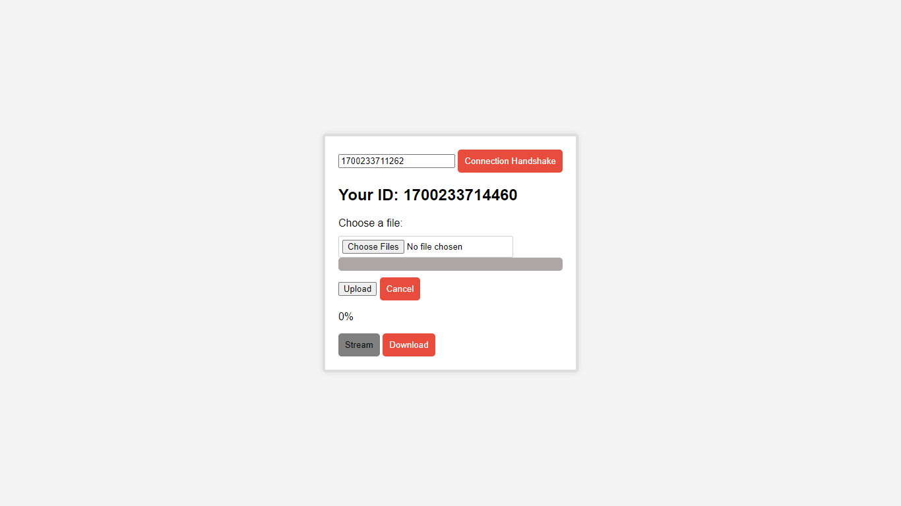

# P2P File Transfer System


## Overview
This P2P File Transfer System is a decentralized file sharing application designed to facilitate fast and efficient file transfers within a local area network. This project aims to optimize data usage by allowing users to share files directly with each other, bypassing the need for external servers. But the initial days of this project would be a cloud service where people upload their files to a server. I created this application for Covenant University students to be able to send files to each other without eating on their monthly available data.

## Installation & Usage

First clone the repository
```sh
git clone https://github.com/adebola-duf/P2P-transfers-or-cloud-services.git
```

Set up the virtual environment
```sh
python -m venv env
```

Activate the virtual environment
```
env/Scripts/activate  # for Windows
source env/bin/activate  # for Unix or MacOS
```

Install the dependencies
```sh
pip install -r requirements.txt
```

Run the server
```sh
uvicorn app:app --reload --host 0.0.0.0 --port 8000
```

## Reflection
In the quest for a decentralized P2P File Transfer System, the journey took unexpected turns. The dream of direct device-to-device file swaps got a reality check, nudging us to create a cloud pitstop. A bit of a detour, yes, but think of it as your files enjoying a quick cloud siesta before reaching their destination.

Unveiling the mysteries of peer-to-peer communication within local networks was enlightening, even if we're not there yet. So, for now, Covenant University students, toss your files into the cloud basket, and let's keep the data plans intact. We're still on the road to making sharing as easy as a Sunday picnic, with a few cloud-shaped twists along the way.

Stay tuned for more updates – who knows, maybe one day those files will zip through the air straight to your friend's device. Until then, happy cloud-hopping!

## Cheers to the Journey! 🚀


